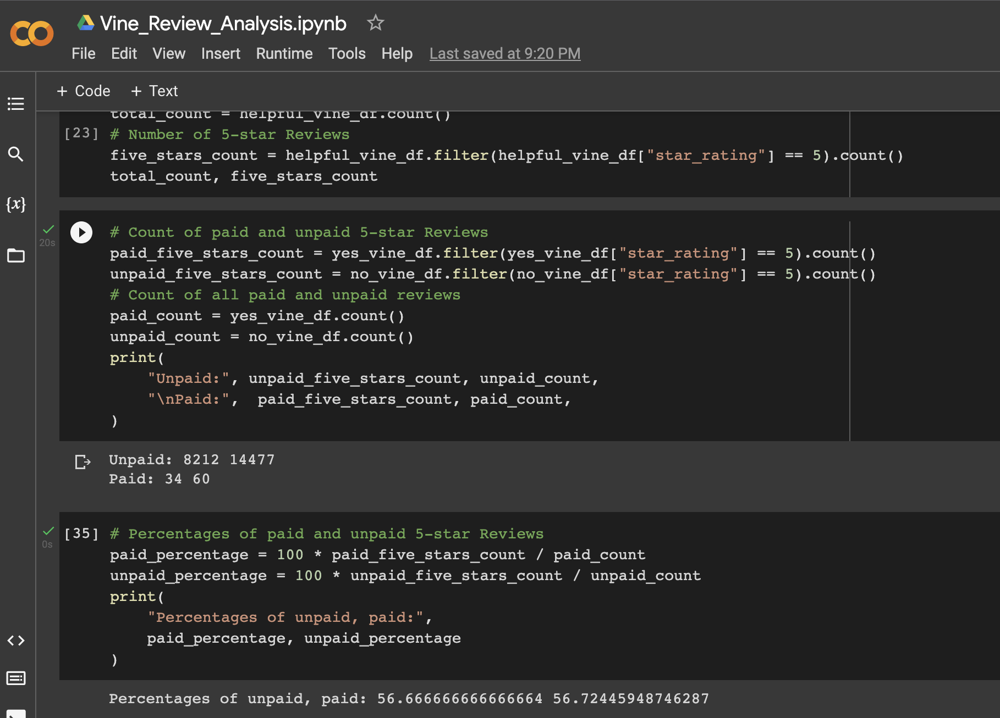

- [Amazon Vine Reviews Analysis](#org88f5342)
  - [Overview](#orgd30b8bd)
  - [Results](#orgf59a5da)
  - [Summary](#org83db767)
  - [Closing Toughts](#org28433da)


<a id="org88f5342"></a>

# Amazon Vine Reviews Analysis


<a id="orgd30b8bd"></a>

## Overview

In this analysis we chose a dataset from Amazon&rsquo;s [Reviews](https://s3.amazonaws.com/amazon-reviews-pds/tsv/index.txt). We picked the Musical Instruments dataset, followed the ETL procedures for processing the data with PySpark and made an analysis of the Vine Reviews table.


<a id="orgf59a5da"></a>

## Results

From all the tables that we managed to upload to our database, we used the Vine Reviews one to determine if there was bias on paid reviews over unpaid ones. We used the `star_rating`, `helpful_votes`, `total_votes` and `vine` columns for for our analysis.

```sql
SELECT * FROM vine_table LIMIT 5;
```

<table><tr><th>review_id</th><th>star_rating</th><th>helpful_votes</th><th>total_votes</th><th>vine</th><th>verified_purchase</th></tr><tr><td>RMDCHWD0Y5OZ9</td><td>3</td><td>0</td><td>1</td><td>N</td><td>N</td></tr><tr><td>RZSL0BALIYUNU</td><td>5</td><td>0</td><td>0</td><td>N</td><td>Y</td></tr><tr><td>RIZR67JKUDBI0</td><td>3</td><td>0</td><td>1</td><td>N</td><td>Y</td></tr><tr><td>R27HL570VNL85F</td><td>5</td><td>0</td><td>0</td><td>N</td><td>Y</td></tr><tr><td>R34EBU9QDWJ1GD</td><td>5</td><td>0</td><td>0</td><td>N</td><td>Y</td></tr></table>

We will use the following criteria for our analysis: we want to consider all reviews with more than 20 votes and than have a majority of helpful votes.

```sql
SELECT vine, COUNT(review_id)
FROM vine_table
WHERE total_votes >= 20
AND CAST(helpful_votes AS FLOAT)/CAST(total_votes AS FLOAT) >=0.5
GROUP BY vine;
```

<table><tr><th>vine</th><th>count</th></tr><tr><td>N</td><td>14477</td></tr><tr><td>Y</td><td>60</td></tr></table>

There are `14477` unpaid reviews and `60` paid reviews. Now we are going to take a look at the PySpark workflow for filtering the data and getting the percentages we want.



We can get the amount of 5-star reviews for both paid and unpaid reviews. We get a total of `34` Vine 5-star reviews and `8212` Non-Vine 5-star reviews, very different sample sizes.

Finally, we can see that, even with the very large size difference on the samples, they have very similar 5-star to non-5-star reviews.

    ------------------------------
    From the Most Helpful Reviews:
    ------------------------------
    Total Count: 14537
    Total Count of 5-star Reviews: 8246
    ------------------------------
    Total Count of Unpaid Reviews: 14477
    Total Count of Paid Reviews: 60
    Percentage of 5-star Unpaid Reviews: 56.72%
    Percentage of 5-star Paid Reviews: 56.67%

In conclusion:

-   There were `60` Vine reviews and `14477` Non-Vine reviews.
-   We got a total of `34` Vine 5-star reviews and `8212` Non-Vine 5-star reviews.
-   If we round to one decimal, the percentage of both types of reviews were `56.7%`.


<a id="org83db767"></a>

## Summary

We have to consider that the more observations we have, the more the distribution will tend to a normal distribution, which looks to be consistent with the Non-Vine data. However, because such a small sample size for the Vine reviews while mantaining the same distribution, we are left with suspicion on the validity of these reviews. This is an indicator of positivity bias on the Vine program, as with such few reviews, it&rsquo;s unlikely that the distribution will be closer than to the larger dataset of non-Vine reviews.

Additionally, we could perform a time series analysis as we count with DateTime data that we can use for binning and charting the data over time, specially on the non-Vine reviews. We can also use Natural Language Processing for getting a better understanding of the content of the Vine reviews and look for repeating patterns on the content of the review.


<a id="org28433da"></a>

## Closing Toughts

We have managed to streamline a Extract, Transform, Load workflow using powerful tools and services. This proves that we can perform these kind of analysis with data that has high velocity, volume and variety in short amount of time and with little to no complexity. It only gets better from here!
